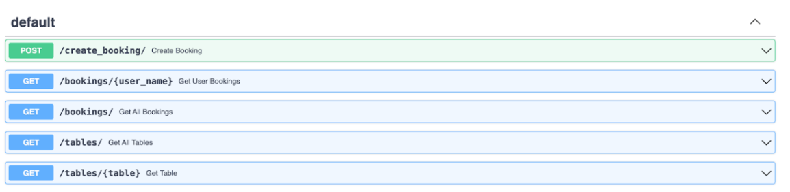

# Restaurant microservice-based application

This is the app consisting of multiple microservices allowing to deliver some restaurant functionality.

Technologies used: Python, Docker Compose, MongoDB, PostgreSQL, Hazelcast

## Order service 

This is a simple ordering service. It allows you to comunicate with a restaurant via simple chat messages. Also, you can get statistics about orders and items.

## Table registration service

Here you can reserve a table in the restaurant at particular hour.

## Support && Support worker services

These services allow for contacting the administrator to get answers and to ensure that admin gets the notification about the new dialogue or changes in the previous ones.

